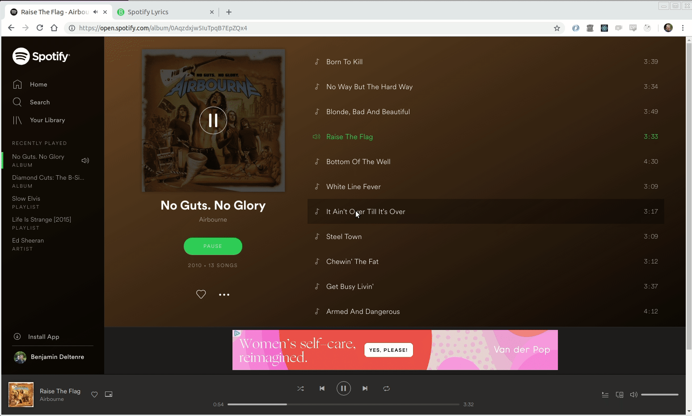
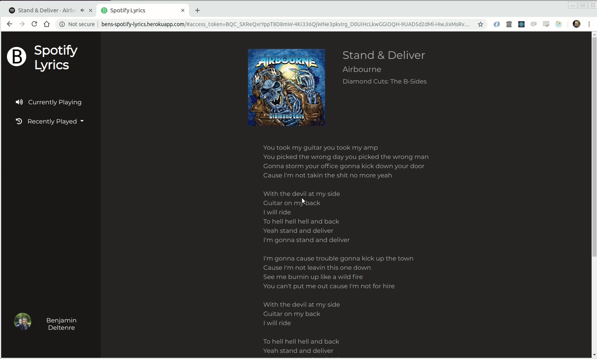

# Spotify-Lyrics

A full stack web app built with **React, Redux** and **Express**. It connects to the **Spotify API** and to **API Seeds Lyrics** to automatically get the information and the lyrics of the track currently being played on the user's Spotify account. Users can also see information and lyrics for the five more recently played tracks on their account,

This app is deployed on [Heroku](http://bens-spotify-lyrics.herokuapp.com/).

## Screenshots



*When logging in Spotify, the lyrics for the currently playing track are displayed.*


*If you start playing another track, click on `Currently Playing` to display its lyrics.*




*You can also get the lyrics for the 5 more recently played tracks on your account.*


## Getting started

- Clone this repository on your local machine and cd into it
- Install the dependencies:
```
yarn
```
- Launch the server: 
```
node server.js
```
- On a different terminal, launch the front-end app:
```
yarn start-dev
``` 
- On your browser, go to http://localhost:3000